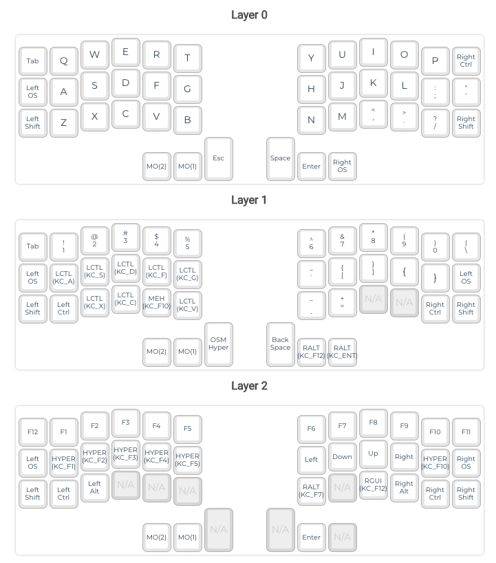

# QMK Firmware
My custom firmware for QMK-based boards

# Corne
Custom key mappings in [keyboards/crkbd/keymaps/rpak-2](keyboards/crkbd/keymaps/rpak-2)

1. Copy `keyboards/crkbd` to `qmk_firmware` directory containing original source code.
1. Build, `make crkbd/rev1:rpak-2`
1. Flash, `make crkbd/rev1:rpak-2:avrdude`

# Ergodox EZ 
QMK Toolbox can be used to flash `ergodox_ez_rpak.hex`. Updated QMK Configuration file is located [here](keyboards/ergodox_ez/keymaps/rpak/qmk_configurator.json).

1. Build, `make ergodox_ez:rpak`
